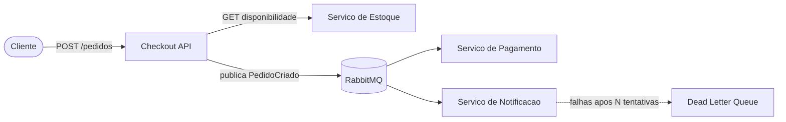

# Ecossistema de E-commerce Distribuido

Projeto pratico da disciplina de Integracao de Aplicacoes, implementando um ecossistema de microsservicos com comunicacao **sincrona** (REST) e **assincrona** (RabbitMQ), alem de padroes de resiliencia (**Circuit Breaker** e **Dead Letter Queue**).

## Arquitetura



### Servicos

| Servico | Porta | Responsabilidade |
|---------|-------|------------------|
| **Frontend Demo** | **8080** | **Painel web para demonstrar todas as funcionalidades** |
| Checkout API | 8000 | Porta de entrada; verifica estoque (sincrono) e publica eventos |
| Servico de Estoque | 8001 | Gerencia disponibilidade de produtos |
| Servico de Pagamento | - | Consome eventos e simula pagamento |
| Servico de Notificacao | - | Consome eventos e simula envio de e-mail (com DLQ) |
| Monitor de Atividades | - | Agrega logs dos servicos para o painel web |
| RabbitMQ | 5672 / 15672 | Message Broker (management UI na 15672) |

## Padroes de integracao implementados

### Marco 1 - Comunicacao sincrona
- Checkout consulta o Estoque via REST antes de confirmar o pedido.
- Contratos documentados em OpenAPI/Swagger.

### Marco 2 - Comunicacao assincrona e resiliencia
- Apos criar o pedido, o Checkout publica o evento `PedidoCriado` no RabbitMQ.
- Pagamento e Notificacao consomem o evento de forma independente (desacoplamento).
- **Circuit Breaker** na chamada Checkout -> Estoque (abre apos 3 falhas consecutivas).
- **Dead Letter Queue (DLQ)** no servico de Notificacao apos numero configuravel de tentativas.

### Marco 3 - Consolidacao
- Logs estruturados em todos os servicos.
- Tratamento de erros consistente.
- Documentacao completa e roteiro de demonstracao.

## Como executar (recomendado: Docker Compose)

### Pre-requisitos
- Docker e Docker Compose instalados

### Subir todo o ecossistema

```bash
docker compose up --build
```

Servicos disponiveis:
- **Painel de demonstracao (recomendado):** http://localhost:8080
- Checkout Swagger: http://localhost:8000/docs
- Estoque Swagger: http://localhost:8001/docs
- RabbitMQ Management: http://localhost:15672 (usuario: `guest`, senha: `guest`)

O frontend oferece formularios para criar pedidos, consultar estoque, testar o Circuit Breaker, executar cenarios rapidos e acompanhar **logs em tempo real** dos servicos (Pagamento, Notificacao, Checkout e Estoque) — sem precisar colar JSON ou abrir outro terminal.

### Parar os servicos

```bash
docker compose down
```

## Como executar localmente (sem Docker)

### 1. RabbitMQ
Instale e inicie o RabbitMQ localmente na porta 5672, ou suba apenas o broker:

```bash
docker run -d --name rabbitmq -p 5672:5672 -p 15672:15672 rabbitmq:3-management
```

### 2. Instalar dependencias

```bash
pip install -r estoque/requirements.txt
pip install -r checkout/requirements.txt
pip install -r pagamento/requirements.txt
pip install -r notificacao/requirements.txt
```

### 3. Iniciar os servicos (4 terminais)

```bash
# Terminal 1 - Estoque
cd estoque && uvicorn main:app --reload --port 8001

# Terminal 2 - Checkout
cd checkout && uvicorn main:app --reload --port 8000

# Terminal 3 - Pagamento
cd pagamento && python main.py

# Terminal 4 - Notificacao
cd notificacao && python main.py
```

## Testes e demonstracao

### 1. Fluxo completo (pedido com sucesso)

`POST http://localhost:8000/pedidos`

```json
{
  "id_pedido": "pedido-001",
  "cliente": "maria@email.com",
  "itens": [
    { "produto_id": "produto_A", "quantidade": 2 },
    { "produto_id": "produto_B", "quantidade": 1 }
  ]
}
```

Resultado esperado:
- Checkout retorna `200` com `status: "criado"`
- Logs do Pagamento mostram aprovacao ou falha simulada
- Logs da Notificacao mostram e-mail enviado

### 2. Estoque insuficiente

```json
{
  "id_pedido": "pedido-002",
  "itens": [
    { "produto_id": "produto_B", "quantidade": 999 }
  ]
}
```

Resultado esperado: `409 Conflict`

### 3. Circuit Breaker (queda do Estoque)

Ative falha simulada no Estoque:

```bash
POST http://localhost:8001/admin/simular-falha?ativo=true
```

Envie 3 pedidos validos. A partir da 3a falha, o Circuit Breaker abre e o Checkout retorna `503` rapidamente, sem insistir no Estoque.

Verifique o estado:

```bash
GET http://localhost:8000/health/circuit-breaker
```

Desative a falha:

```bash
POST http://localhost:8001/admin/simular-falha?ativo=false
```

Aguarde 30 segundos (tempo de recuperacao) ou reinicie o checkout para resetar o circuit breaker.

### 4. Dead Letter Queue (falhas na Notificacao)

Com Docker Compose, altere no `docker-compose.yml`:

```yaml
notificacao:
  environment:
    SIMULAR_FALHA: "true"
```

Reinicie o servico de notificacao:

```bash
docker compose up --build notificacao
```

Envie um pedido. Apos 3 tentativas, a mensagem vai para a fila `notificacao.dlq`. Verifique no RabbitMQ Management (aba Queues).

## Documentacao dos contratos de API (OpenAPI)

Arquivos exportados:
- `checkout/openapi.json`
- `estoque/openapi.json`

Swagger UI em execucao:
- http://localhost:8000/docs
- http://localhost:8001/docs

## Estrutura do projeto

```
.
├── checkout/          # API REST + Circuit Breaker + publicador de eventos
├── estoque/           # API REST de disponibilidade
├── pagamento/         # Consumidor assincrono
├── notificacao/       # Consumidor assincrono com DLQ
├── shared/            # Configuracao compartilhada do RabbitMQ
├── frontend/          # Painel web de demonstracao (nginx)
├── monitor/           # Agregador de logs em tempo real (SSE)
├── docker-compose.yml
└── README.md
```

## Decisoes de design

- **Python + FastAPI**: simplicidade e geracao automatica de OpenAPI.
- **RabbitMQ**: broker leve, facil de rodar via Docker, suporte nativo a DLQ.
- **Exchange topic `pedidos`**: permite evoluir para novos tipos de evento no futuro.
- **Circuit Breaker customizado**: evita dependencia extra e atende ao requisito didatico.
- **Estoque em memoria**: foco na integracao, nao em persistencia.
- **Pagamento com falha aleatoria**: simula comportamento real de gateways de pagamento.

## Produtos e precos de referencia

| Produto | Estoque | Preco (R$) |
|---------|---------|------------|
| produto_A | 10 | 29,90 |
| produto_B | 5 | 49,90 |
| produto_C | 0 | 19,90 |
